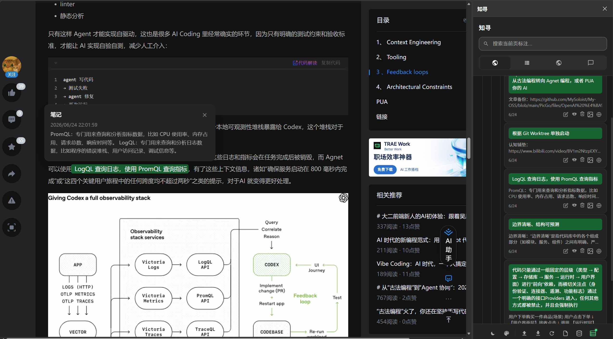
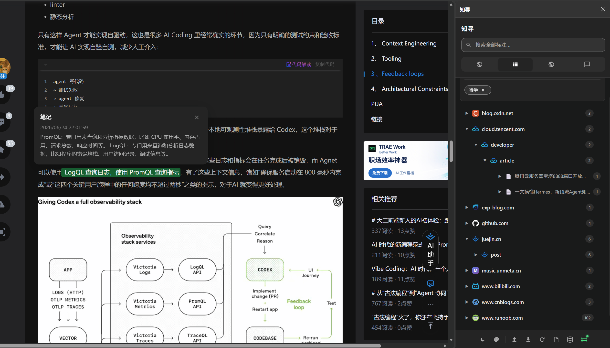
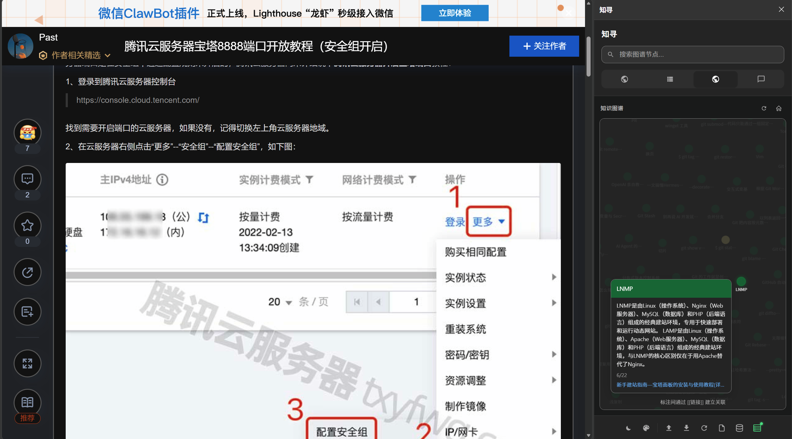
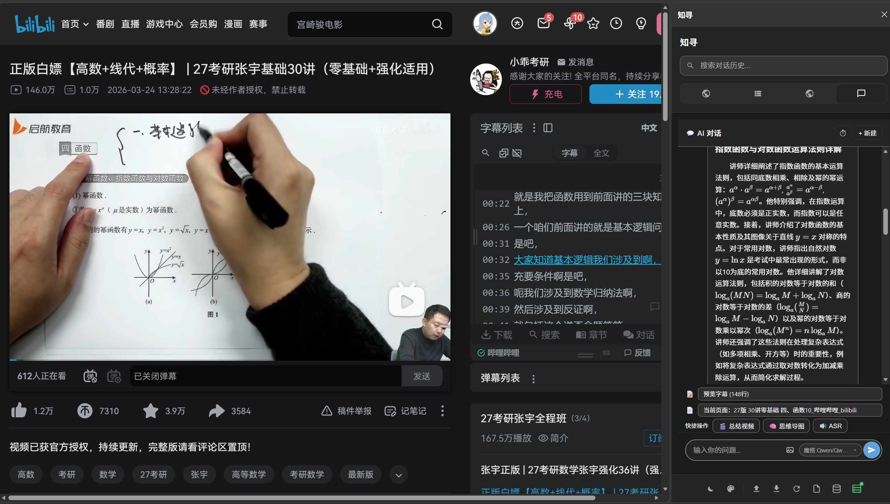
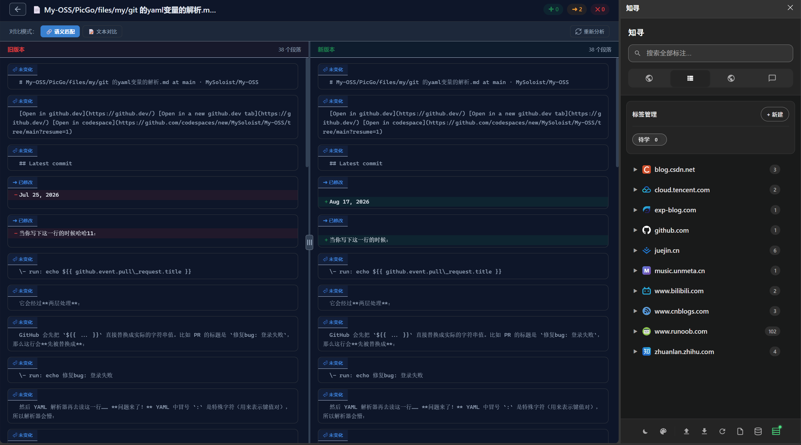
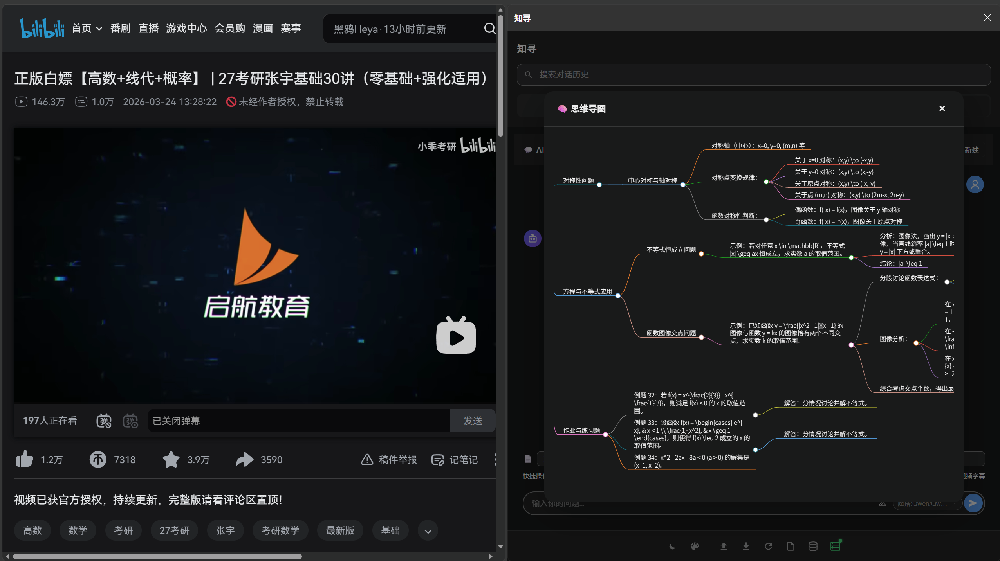

# 知寻 KnowSeek

知寻是一款基于 AI 的浏览器知识管理扩展，让你在浏览网页、观看视频时随手标注与记录，并沉淀为个人知识库。

## 功能亮点

- **网页标注系统**：选中网页文本/图片/视频帧即可添加高亮和笔记，颜色、标签自由管理
- **侧边栏管理中心**：标注按 URL 层级（域名 → 路径 → 页面）自动归档，点击卡片一键跳回原文高亮位置
- **知识图谱**：笔记中的 `[[双向链接]]` 与标签自动生成可视化图谱，直观呈现标注之间的关联
- **AI 智能助手**：基于标注上下文与 RAG 检索，侧边栏内直接与知识库对话问答
- **ASR字幕转写**：无字幕视频自动启用语音识别（Whisper 本地 / FunASR 在线双引擎）转为文字
- **AI 思维导图**：一键将文本/视频内容整理为 Markdown 思维导图，可视化呈现知识结构
- **视频智能总结**：输入 B 站视频链接，自动拉取字幕、使用ffmpeg抽取关键变换帧，生成结构化总结
- **内容变更检测**：监控已收藏页面，用 diff 算法识别内容变化并生成变更报告
- **自动网页快照**：标注时自动截取当前页面画面，留存原始上下文，随时回顾
- **RSS 动态**：订阅网站 RSS 更新，聚合展示最新内容动态
- **数据备份与恢复**：支持导出备份文件，数据安全可控
- **本地优先存储**：标注、截图、知识库全部保存在本地浏览器，数据自主可控，导出即迁移
- **云备份与定时备份**：支持 WebDAV / 自建后端定时自动云备份，手动一键即可随时备份


## 效果展示









## 项目结构

```
KnowSeek/
├── extension/   # 浏览器扩展（WXT + React + TypeScript）
├── server/      # 后端服务（FastAPI + ChromaDB + litellm）
└── docs/        # 文档
```
## 技术栈

| 端 | 技术 |
|----|------|
| 扩展 | TypeScript, React 19, WXT, Vite, Zustand, IndexedDB |
| 后端 | Python, FastAPI, Uvicorn, ChromaDB, litellm |
| AI 能力 | 多 LLM 统一接入（litellm）、向量检索（ChromaDB）、Whisper 语音识别 |
| 内容处理 | Readability 正文提取、yt-dlp 视频下载、ffmpeg 视频处理 |

## 环境要求

本项目在以下环境中开发与验证通过：

| 类别 | 版本 |
|------|------|
| 操作系统 | Windows 11（Windows 10 / macOS / Linux 亦可运行） |
| Node.js | ≥ 18（WXT / React 19 要求；验证版本 v24.14.1） |
| npm | 随 Node.js 安装（验证版本 11.11.0） |
| Python | 3.10+（验证版本 3.11.9） |
| ffmpeg | 全量构建版（验证版本 2025-12-31 full build），需加入 PATH |
| yt-dlp | 2026.7.4（随后端 `pip install` 自动安装，无需单独配置） |
| 浏览器 | Chrome / Edge 等 Chromium 内核浏览器（验证版本 Chrome 151） |

> ffmpeg 仅「视频智能总结」的帧抽取功能需要；未安装时该项功能不可用，不影响其余功能。

## 快速开始

### 1. 后端服务

```bash
cd server
python -m venv .venv
.\.venv\Scripts\Activate.ps1    # Windows
pip install -r requirements.txt
uvicorn main:app --host 0.0.0.0 --port 8765
```

**（可选）B 站等平台的高清视频下载需要 cookies：**

视频下载依赖 yt-dlp，B 站部分视频（尤其高清晰度）需要登录态才能下载。将浏览器的 B 站登录 cookies 导出为 Netscape 格式文件，命名为 `cookies.txt` 放到 `server/` 目录即可（文件不存在时自动降级为非登录下载，不影响其他功能）。

获取方式：安装浏览器扩展 **「Get cookies.txt LOCALLY」**，在 B 站页面点击并导出 cookie，保存为 `server/cookies.txt`。

**（可选）RSS 动态功能依赖 RSSHub：**

「动态」标签页通过后端代理订阅 RSSHub 数据源（默认地址 `http://localhost:8080`），需先自建一个 RSSHub 实例（也可自行搜索公共实例使用）：

```bash
docker run -d --name rsshub -p 8080:1200 diygod/rsshub
```

启动后回到 popup **「动态」** 标签页，点击 **RSSHub 地址** 输入框旁的「测试」，连接成功后即可添加订阅源（输入 RSS 链接或 `/bilibili/user/video/{uid}` 这类路由）。

> ⚠️ 若 RSSHub 部署端口不是 8080，请把地址改为实际地址，如 `http://localhost:1200`。

### 2. 浏览器扩展

```bash
cd extension
npm install
npm run dev     # 开发模式，自动打开浏览器加载
# 或
npm run build   # 生产构建，产物在 .output/chrome-mv3/
```

**加载构建产物到 Chrome：**

1. 打开 `chrome://extensions`
2. 右上角开启「开发者模式」
3. 点击「加载已解压的扩展程序」
4. 选择 `extension/.output/chrome-mv3/` 目录（需包含 `manifest.json`）

加载成功后，使用方式：
- 点击浏览器右上角扩展图标 → 打开 **popup** 窗口
- 任意网页点击扩展图标 → 展开**侧边栏**，即可开始网页标注

**连接后端服务（可选，启用 AI 对话/视频总结/RSS 代理等高级功能）：**

1. 侧边栏工具栏点击 **高级服务** 图标
2. 填写 **API 密钥**：与后端一致（默认为 `sk-knowseek-demo`，可通过环境变量 `API_KEY` 修改）。后端地址固定为 `http://localhost:8765`，无需填写
3. 点击「测试连接」，显示连接成功后即可使用高级功能


> 修改扩展代码后需重新 `npm run build`，并在 `chrome://extensions` 点击扩展卡片上的刷新按钮，再打开 popup/侧边栏生效。

## 开源许可

本项目基于 [MIT License](./LICENSE) 开源。